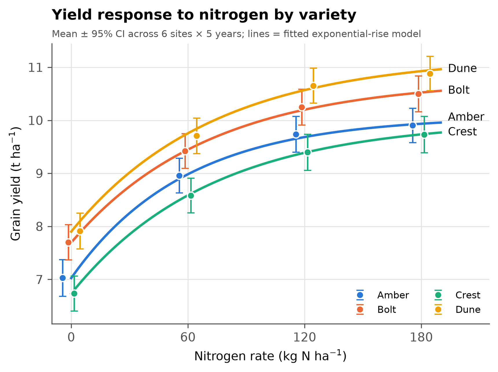
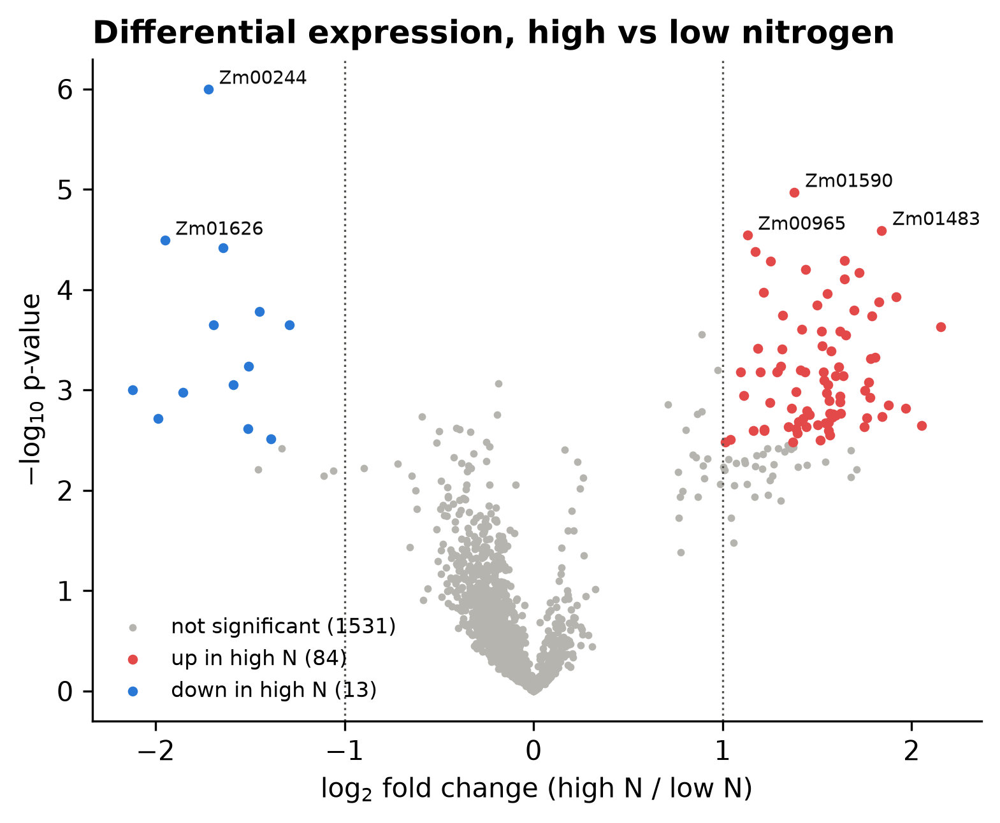

---
hide:
  - navigation
  - toc
---

# Scripting 101

**From command-line basics to data-analysis automation.** A hands-on course for complete beginners. No Linux, programming, Conda or Git experience needed.

By the end you will **independently build, troubleshoot, document, version-control and run Bash and Python workflows for real scientific datasets**, and publish them so anyone can reproduce your results with one command.

[Get started :material-arrow-right:](getting-started.md){ .md-button .md-button--primary }
[Syllabus](syllabus.md){ .md-button }
[Downloads](downloads.md){ .md-button }

## Modules

{{MODULE_TABLE}}

## How the course works

-   :material-console: **Learning by doing**

    Short explanations, then the keyboard. Every module has guided labs with expected output, independent exercises and challenges.

-   :material-sprout: **One real-looking dataset**

    A 5-year, 6-site maize nitrogen trial plus a genomics side-project, with realistic problems hidden inside for you to discover.

-   :material-source-branch: **Reproducible from day one**

    Scripts instead of clicks, pinned software environments, Git history, and a capstone that a stranger can rerun.

## What you will build

{ loading=lazy }

{ loading=lazy }

*Left: the capstone analysis of the maize trial. Right: the Module 4 project, a differential-expression program run from the command line.*
